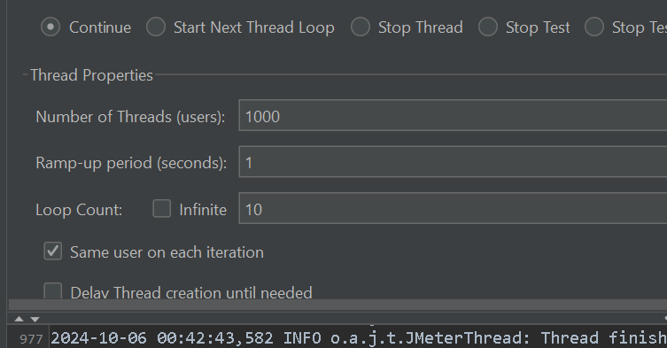
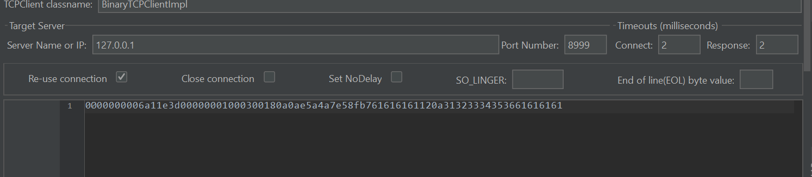

# 游戏服务器框架 gameServer
    JDK17
    apache-maven-3.9.5
    脚本工具:protoc-28.2-win64  https://github.com/protocolbuffers/protobuf/releases

## 启动方式 
    先在protobufFilem目录下执行脚本toJava.bat,然后对所有模块maven进行clean，install成功即可

# 模块：
# [common](common)
    摘要 公共模块，底层核心模块，以及工具类的开发，开发待续.....
## 注解 
    @ToMethod:作用于类上，表明这个类为与客户端交互的类
    
    @ToServer:
              1，作用于方法上，表明这个方法为与客户端响应的方法；
              2，注解参数：协议唯一id
              3，注意方法参数格式(ChannelHandlerContext,proto生成类,userId),第一个参数必须为ChannelHandlerContext,第二参数必须为proto生成类,第三参数为long类型userId
              4，SendMsg.java 消息发送根据

# [demo](demo)
    为了演示增加的模块，里面有演示的示例，后续可删除，也可做业务模块

# [entrance](entrance)
    主启动类，程序入口,开发待续.....

# [fight](fight)
    战斗服，战斗逻辑，开发待续.....

# [gateway](gateway)
    网关服，开发待续....

# [protobufFile](protobufFile)
    存放protobuf文件，diy.proto里面有脚本toJava.bat用作生成java类

# 目前本地测试可以轻松应付 1000线程， 2毫秒连接响应， 2毫秒回响应

